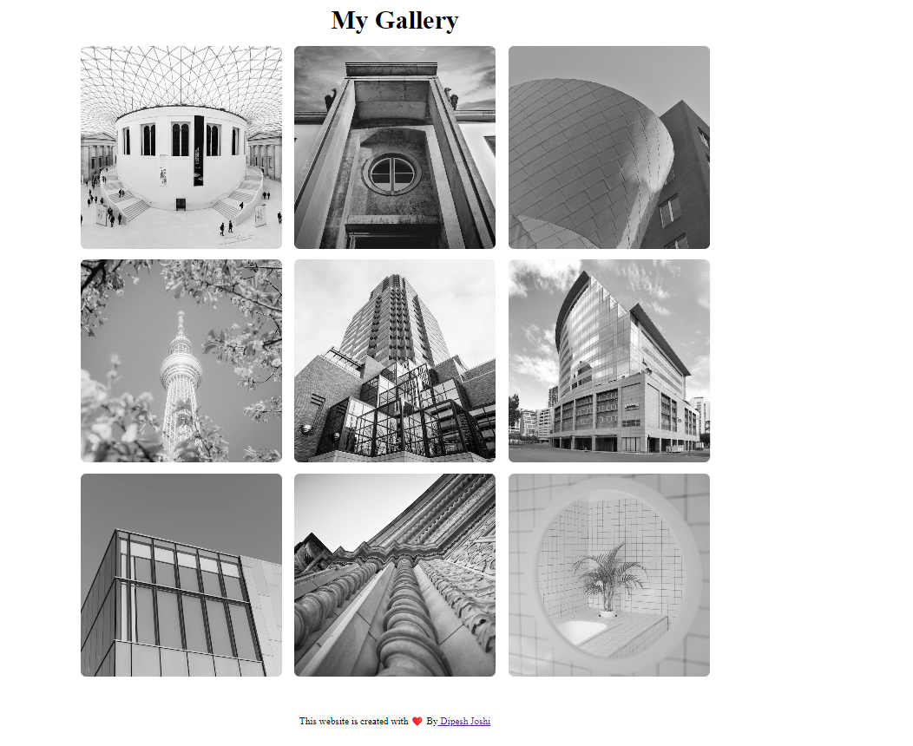

# Image-Gallery-
my image-gallery project its one of the project which i made
this is one photo image page which is enhance your background and gives the best quality photos just like Unsplash
 ## 🔗 Tech Stack

**Web-development skills:** HTML and Css.

**Source code editor:** VS Code

**Version control system**: Git and Github.

## 🔗 Live Link
 

# Replicate the Following Output

`Assests are Provided!`

## 🔗 Links

